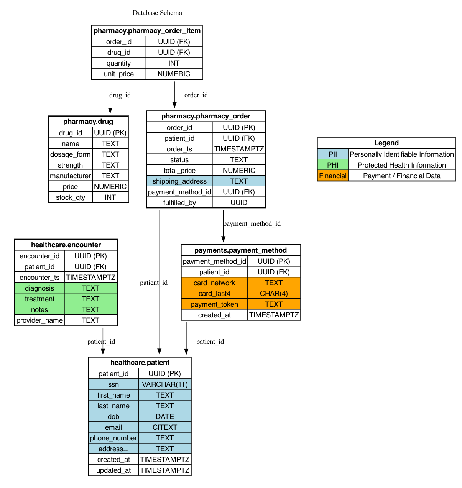

# AuditR & LoadR

This repository contains two complementary tools designed for the Practicum capstone project on **Database Audit Logging & Enrichment**:

- **AuditR** → CLI tool for parsing, enriching, verifying, and querying database audit logs (PostgreSQL pgAudit & MySQL Percona Audit Plugin).  
- **LoadR** → Synthetic data + workload generator for PostgreSQL/MySQL, used to produce realistic queries that exercise PII, PHI, and financial data fields.

Together they form a complete demo pipeline:  
**LoadR → Database (pgAudit / Percona) → Audit logs → AuditR → Enriched compliance reports**

## 🚀 Quick Start

```bash
# 1. Build the tools
make

# 2. Generate and load test data
./bin/loadr load --config cmd/loadr/config/load_pg.yaml
createdb practicumdb && psql -d practicumdb -f seed_pg.sql

# 3. Run workload to generate audit logs
./bin/loadr run --config cmd/loadr/config/run_pg.yaml

# 4. Parse audit logs
./bin/auditr parse --db postgres --input /path/to/pgaudit.log --output parsed.ndjson --emit-raw

# 5. Extract schema
psql -d practicumdb -c "SELECT current_database(), schemaname, tablename, attname, format_type(atttypid, atttypmod) FROM pg_attribute a JOIN pg_class c ON a.attrelid = c.oid JOIN pg_namespace n ON c.relnamespace = n.oid JOIN pg_tables t ON c.relname = t.tablename AND n.nspname = t.schemaname WHERE a.attnum > 0 AND NOT a.attisdropped ORDER BY schemaname, tablename, attname;" --csv > schema.csv

# 6. Enrich with sensitivity detection
./bin/auditr enrich --schema schema.csv --dict cmd/auditr/config/sensitivity_dict_extended.json --risk cmd/auditr/config/risk_scoring.json --input parsed.ndjson --output enriched.ndjson --emit-unknown

# 7. Analyze results
jq '.risk_level' enriched.ndjson | sort | uniq -c
```

# 📋 Prerequisites
Before using AuditR and LoadR, ensure the following:

PostgreSQL 16 with:
- pgAudit extension installed and enabled (shared_preload_libraries = 'pgaudit').
- citext extension installed in your target DB (CREATE EXTENSION citext;).

MySQL 8 with:
- Percona Audit Log Plugin

# 🚀 LoadR: Data & Workload Generator
## Database Schema

The database schema models a simplified healthcare, pharmacy, and payments system.  
It is designed to include realistic **relationships** and **sensitive data types** for workload simulation and auditing.

### Highlights
- **Healthcare**: Patients and their encounters (PHI + PII).  
- **Pharmacy**: Drugs, orders, and order items (joins to patients and payments).  
- **Payments**: Payment methods linked to patients (Financial data).  
- **Foreign keys** ensure consistency across schemas in both PostgreSQL and MySQL.  
- **Sensitive fields** are explicitly marked and color-coded in the diagram.

### Sensitivity Legend
- 🟦 **PII**: Personally Identifiable Information  
- 🟩 **PHI**: Protected Health Information  
- 🟧 **Financial**: Payment / Financial Data  

### ER Diagram


*(SVG version available in `docs/schema.svg` for zoomable detail.)*

## Data Generation
### Data Generation Phase (loadr load)
LoadR generates ready-to-import SQL seed files containing:

#### Schema (DDL)
- **Postgres**: creates healthcare, pharmacy, and payments schemas.
- **MySQL** : creates one DB (practicumdb) with prefixed table names.

#### Indexes
- On common PII/PHI/Financial fields for efficient lookups.

#### Synthetic Data
- Patients, encounters, drugs, orders, payments.
- Uses [gofakeit](https://github.com/brianvoe/gofakeit) and curated lists (see common_data.go).
- Consistent FKs across tables (patient_ids, order_ids, drug_ids).

#### Database Users
- Creates multiple users (appuser1..N) with password.
- Grants them SELECT/INSERT/UPDATE/DELETE on all tables.
 
### Example Config (`config_pg.yaml`)

```yaml
driver: postgres            # Target driver: postgres or mysql
database: practicumdb       # Database name
output: seed_pg.sql         # Output SQL file
seed: 42                    # RNG seed for reproducibility

patients: 1000              # Number of patients
encounters: 2000            # Number of encounters
drugs: 200                  # Number of drugs
orders: 1500                # Number of pharmacy orders
dbUsers: 5                  # Number of database users (appuser1..5)
```

### Example Config (`config_mysql.yaml`)
```yaml
driver: mysql
database: practicumdb
output: seed_mysql.sql
seed: 42

patients: 1000
encounters: 2000
drugs: 200
orders: 1500
dbUsers: 5
```

### Usage
```bash
make

# Build binaries
make

# Generate Postgres seed SQL
./bin/loadr load --config config_pg.yaml

# Generate MySQL seed SQL
./bin/loadr load --config config_mysql.yaml

```
This produces `seed_pg.sql` or `seed_mysql.sql` containing:

- `DROP/CREATE SCHEMA` (Postgres) or `DROP/CREATE DATABASE` (MySQL).
- `CREATE TABLE` statements with comments annotating PII, PHI, Financial fields.
- `INSERT` statements with synthetic values.
- `CREATE INDEX` statements on key fields.
- `CREATE USER` and `GRANT` statements for multi-user audit simulation.

### Import into DB:
``` bash
# Postgres
createdb -U vaibhaw practicumdb
psql -U <admin_user> -d practicumdb -f seed_pg.sql

# MySQL
mysql -u <admin_user> -p <pwd> < seed_mysql.sql
```
### 🔍 Verification

After seeding, you can verify your data and users with:

```bash
# Postgres
psql -U <user> -d practicumdb -f verify_pg.sql

# MySQL
mysql -u <user> -p practicumdb < verify_mysql.sql
```
The verify scripts are available under `/scripts`.
## Workload Generation
### Workload Phase (`loadr run`)

After seeding, **LoadR** can simulate realistic database workloads that generate audit logs. Queries are executed directly against the DB under multiple app users.

#### Features
- **Operation mix**: configurable ratio of `SELECT` (reads) vs `UPDATE` (writes).  
- **Sensitivity mix**: configurable ratio of queries targeting sensitive-only (PII/Financial), mixed (PII + PHI + Financial), and non-sensitive data.  
- **User simulation**: queries are executed under different users (`appuser1..N`) to simulate multiple actors.  
- **Annotations**: every query includes identifying comments (run ID, op type, sensitivity, user, timestamp) to aid log analysis.  
- **Concurrency**: configurable workers and total operations; RNG seed ensures reproducibility.

#### Example Config (`run_pg.yaml`)
```yaml
driver: postgres
database: practicumdb

users:
  - username: appuser1
    password: <>
  - username: appuser2
    password: <>
  - username: appuser3
    password: <>
  - username: appuser4
    password: <>
  - username: appuser5
    password: <>

seed: 42
runId: pg_demo001

concurrency: 5
totalOps: 200

mix:                      # Operation mix
  select: 0.7
  update: 0.3

sensitivity:              # Sensitivity mix
  sensitive_only: 0.4
  mixed: 0.4
  non_sensitive_only: 0.2

host: 127.0.0.1
port: 5432
```
### Usage
```bash
# Run Postgres workload
./bin/loadr run --config run_pg.yaml

# Run MySQL workload
./bin/loadr run --config run_mysql.yaml
```
This will
- Connect as multiple users (`appuserN`).
- Execute queries per the configured workload.
- Insert identifying comments in each query for downstream parsing by AuditR.
- Generate realistic audit log entries in pgAudit (Postgres) or Percona Audit Plugin (MySQL).

#### Sample Annotated Query
Workload queries are annotated to make audit logs self-describing:
```sql
/* run_id=pg_demo001 op=select sensitivity=mixed user=appuser3 ts=2025-09-13T10:00:00Z */
SELECT p.email, e.diagnosis, o.total_price, pm.card_last4
FROM healthcare.patient p
JOIN healthcare.encounter e ON p.patient_id = e.patient_id
JOIN pharmacy.pharmacy_order o ON p.patient_id = o.patient_id
JOIN payments.payment_method pm ON p.patient_id = pm.patient_id
WHERE p.patient_id = 'f1a2b3c4-5678-90ab-cdef-1234567890ab'
LIMIT 5;
```
#### 🔍 Verification after run
Once the workload completes:
1. **Check audit logs** :
    -  Postgres: queries should appear in pgAudit logs, including the identifying comments.
    - MySQL: queries should appear in the Percona Audit Log Plugin output.
2. **Confirm multi-user activity**:
    - Ensure queries in logs show different appuserN roles.
3. **Verify updates**:
    - Run queries in the DB to confirm changes, e.g.:
    ```sql
    SELECT phone_number FROM healthcare.patient LIMIT 5;
    SELECT stock_qty FROM pharmacy.drug LIMIT 5;
    ```
4. **Look for annotations**:
    - Every logged query should include the `/* run_id=... */` comment block for traceability.
    - Likely file path on MacOS Homebrew:
        - **Postgres** : `/opt/homebrew/var/log/postgresql@16.log` 
        - **MySQL** : `/opt/homebrew/var/mysql/audit.log`

# 🔍 AuditR: Audit Log Enricher
AuditR is a CLI tool that processes database audit logs into tamper-evident, enriched compliance reports.

## Features

* **Parse** PostgreSQL pgAudit or MySQL Percona Audit Log Plugin logs
* **Normalize** into NDJSON format with structured event data
* **Enrich** with schema metadata, sensitivity classification, and risk scoring
* **Detect** bulk operations (SELECT *, COPY, LOAD DATA) automatically
* **Classify** sensitive data (PII, PHI, Financial) using regex-based dictionaries
* **Score** risk levels (low, medium, high, critical) based on data combinations
* **Handle errors** gracefully - never lose data, emit structured ERROR events
* **Log comprehensively** with configurable output levels and run summaries
* **Support** both PostgreSQL and MySQL audit log formats

## Logging Configuration

AuditR provides flexible logging configuration to help with debugging and monitoring:

### Log Levels

* **debug**: Detailed information for troubleshooting
* **info**: General operational information (default)
* **warn**: Warning conditions
* **error**: Error conditions that should be investigated

### Log Outputs

* **Console**: Always enabled, with configurable minimum level
* **Debug File**: Optional JSON file for all debug and above logs
* **Info File**: Optional JSON file for info and above logs
* **Run Log**: Append-only JSONL file for run summaries

### Example Configuration

```yaml
logging:
  # Minimum log level for all outputs
  level: "info"
  # Minimum level for console output (can be higher than file level)
  console_level: "info"
  # Debug log file (optional) - includes all debug level and above logs
  debug_file: "./logs/debug.jsonl"
  # Info log file (optional) - includes all info level and above logs
  info_file: "./logs/info.jsonl"
  # Run summary log file - append-only JSONL
  run_log: "./logs/run_log.jsonl"
  # Development mode enables more verbose output
  development: true
```

### Debug Features

When troubleshooting, you can enable debug logging to see:

* **Parser Details**:
  - SQL query extraction and classification
  - Bulk operation detection
  - Authentication events
  - Parsing decisions and context

* **Processing Stats**:
  - Progress updates every 1000 lines
  - Lines processed per second
  - Parse success/reject ratios
  - Run duration and summary

* **File Operations**:
  - Input/output file handling
  - Reject file operations
  - Run log updates

### Example Debug Output

```
2025-09-22T10:00:00.000Z DEBUG attempting SQL extraction {"line_length": 256}
2025-09-22T10:00:00.001Z DEBUG found potential SQL matches {"count": 1}
2025-09-22T10:00:00.001Z DEBUG checking SQL candidate {"index": 0, "candidate": "SELECT * FROM patients", "looks_like_sql": true}
2025-09-22T10:00:00.002Z DEBUG checking for bulk operation {"query": "SELECT * FROM patients"}
2025-09-22T10:00:00.002Z DEBUG checking SELECT for full table read {"has_where": false}
2025-09-22T10:00:00.002Z DEBUG detected full table SELECT
2025-09-22T10:00:00.003Z DEBUG successfully parsed event {"event_id": "abc-123", "query_type": "SELECT", "db_user": "alice"}
```

### Recommended Usage

1. For normal operation:
   ```yaml
   level: "info"
   console_level: "info"
   run_log: "./logs/run_log.jsonl"
   ```

2. For troubleshooting:
   ```yaml
   level: "debug"
   console_level: "info"  # Keep console clean
   debug_file: "./logs/debug.jsonl"
   info_file: "./logs/info.jsonl"
   development: true
   ```

## CLI Commands

AuditR provides several subcommands for different phases of audit log processing:

```bash
auditr [command] --help

Available Commands:
  parse       Convert raw DB audit logs → NDJSON events
  enrich      Enrich parsed audit events with sensitivity classification and risk scoring
  verify      Compute/validate hash chain, generate/verify checkpoints
  dict        Validate sensitivity dictionaries and risk scoring configs
  version     Show AuditR version
```

### 1. Parse Command

Convert raw audit logs into structured NDJSON format:

```bash
# Parse PostgreSQL pgAudit logs
auditr parse --db postgres --input pgaudit.log --output parsed.ndjson --emit-raw

# Parse MySQL Percona Audit logs
auditr parse --db mysql --input mysql_audit.log --output parsed.ndjson --emit-raw --reject-file rejected.jsonl

# Parse with streaming (tail mode)
auditr parse --db postgres --input pgaudit.log --follow --emit-raw
```

**Input**: Raw audit log files from pgAudit or Percona Audit Plugin  
**Output**: NDJSON with structured events like:

```json
{
  "event_id": "abc-123-def",
  "timestamp": "2025-01-01T12:00:00Z",
  "db_system": "postgres",
  "db_user": "appuser1",
  "query_type": "SELECT",
  "raw_query": "SELECT ssn, email FROM healthcare.patient WHERE patient_id = '123';"
}
```

### 2. Enrich Command

Add sensitivity classification, risk scoring, and bulk operation detection:

```bash
# Basic enrichment
auditr enrich \
  --schema postgres_schema.csv \
  --dict sensitivity_dict_extended.json \
  --risk risk_scoring.json \
  --input parsed.ndjson \
  --output enriched.ndjson \

# With debug information and unknown event emission
auditr enrich \
  --schema postgres_schema.csv \
  --dict sensitivity_dict_extended.json \
  --risk risk_scoring.json \
  --input parsed.ndjson \
  --output enriched.ndjson \
  --emit-unknown \
  --debug
```

**Input**: NDJSON from parse command + schema CSV + sensitivity dictionary + risk scoring policy  
**Output**: Enriched NDJSON with sensitivity and risk information:

```json
{
  "event_id": "abc-123-def",
  "timestamp": "2025-01-01T12:00:00Z",
  "db_system": "postgres",
  "db_user": "appuser1",
  "query_type": "SELECT",
  "raw_query": "SELECT ssn, email FROM healthcare.patient WHERE patient_id = '123';",
  "sensitivity": ["PII:ssn", "PII:email"],
  "risk_level": "medium",
  "bulk": false
}
```

### 3. Verify Command

Compute or validate per-event hash chains and manage checkpoints.

```bash
# Hash mode – writes hash fields, auto-checkpoint at file end if configured
auditr verify \
  --input enriched.ndjson \
  --output hashed.ndjson \
  --checkpoint            # optional (overrides config to force checkpoint)
  --private-key private.pem

# Hash mode without checkpointing (no private key needed)
auditr verify \
  --input enriched.ndjson \
  --output hashed.ndjson

# Verify mode – validate hash chain integrity only (no checkpoint verification)
auditr verify \
  --input hashed.ndjson \
  --summary              # print one-line result

# Verify mode with checkpoint validation – validate hash chain + checkpoint signature
auditr verify \
  --input hashed.ndjson \
  --checkpoint-path ./checkpoints/checkpoint-<ts>-<idx>.json \
  --public-key public.pem \
  --detailed
```

**Mode Selection:**
- **Hash mode**: When `--output` is provided (writes hashed file)
- **Verify mode**: When no `--output` is provided (reads and verifies existing hashed file)

**Key Requirements:**
- **Private key**: Only needed for hash mode when creating checkpoints (`--checkpoint` or `hashing.checkpoint_interval: file_end`)
- **Public key**: Only needed for verify mode when validating checkpoints (`--checkpoint-path` provided)

Notes:
- Summary/detailed:
  - `--summary` prints a single line and writes a slim run_log entry.
  - `--detailed` prints richer info and adds `duration_ms` to the run_log.
- Auto-checkpointing: if `hashing.checkpoint_interval: file_end` in config, a checkpoint is written at the end of each hash run without needing `--checkpoint`.
- Multi-file continuity: the chain continues across runs using `hashing.state_file`. Verifying files independently may flag the first event of a later file unless you verify the concatenated stream or reset state.

### 4. Schema CSV Format

The `--schema` flag expects a CSV file with the following format:

```csv
db_name,schema_name,table_name,column_name,column_type
practicumdb,healthcare,patient,patient_id,uuid
practicumdb,healthcare,patient,ssn,varchar
practicumdb,healthcare,patient,email,varchar
practicumdb,healthcare,patient,dob,date
practicumdb,healthcare,encounter,diagnosis,text
```

**Generate schema CSV:**
```bash
# PostgreSQL
psql -d practicumdb -c "
SELECT 
  current_database() as db_name,
  schemaname as schema_name,
  tablename as table_name,
  attname as column_name,
  format_type(atttypid, atttypmod) as column_type
FROM pg_attribute a
JOIN pg_class c ON a.attrelid = c.oid
JOIN pg_namespace n ON c.relnamespace = n.oid
JOIN pg_tables t ON c.relname = t.tablename AND n.nspname = t.schemaname
WHERE a.attnum > 0 AND NOT a.attisdropped
ORDER BY schemaname, tablename, attname;
" --csv > postgres_schema.csv

# MySQL
mysql -u user -p -D practicumdb -e "
SELECT 
  TABLE_SCHEMA as db_name,
  'default' as schema_name,
  TABLE_NAME as table_name,
  COLUMN_NAME as column_name,
  COLUMN_TYPE as column_type
FROM INFORMATION_SCHEMA.COLUMNS 
WHERE TABLE_SCHEMA = 'practicumdb'
ORDER BY TABLE_NAME, COLUMN_NAME;
" --batch --raw > mysql_schema.csv
```

## 📑 Sensitivity Dictionaries

AuditR uses JSON dictionaries to detect sensitive fields with regex-based matching:

### Dictionary Structure

```json
{
  "PII": [
    {
      "regex": "(?i)^ssn$",
      "expected_types": ["VARCHAR", "CHAR", "TEXT"],
      "sample_pattern": "^\\d{3}-\\d{2}-\\d{4}$"
    },
    {
      "regex": "(?i)^email$",
      "expected_types": ["VARCHAR", "TEXT"],
      "sample_pattern": ".+@.+\\..+"
    }
  ],
  "PHI": [
    {
      "regex": "(?i)diagnosis",
      "expected_types": ["VARCHAR", "TEXT"],
      "sample_pattern": ".*"
    }
  ],
  "Financial": [
    {
      "regex": "(?i)card.*last",
      "expected_types": ["VARCHAR", "CHAR"],
      "sample_pattern": "^\\d{4}$"
    }
  ],
  "negative": [
    {
      "regex": "(?i).*_id$",
      "reason": "ID fields are not sensitive data"
    }
  ]
}
```

### Risk Scoring Policy

```json
{
  "base": {
    "PII": "medium",
    "PHI": "high", 
    "Financial": "high"
  },
  "combinations": {
    "PII+PHI": "high",
    "PII+Financial": "critical",
    "PHI+Financial": "critical",
    "PII+PHI+Financial": "critical"
  },
  "default": "low"
}
```

### Features

* **Regex-based matching** for flexible column name detection
* **Type validation** ensures matches are on appropriate data types
* **Sample patterns** for additional validation (optional)
* **Negative rules** prevent false positives on ID fields, etc.
* **Risk combinations** handle multiple sensitivity categories
* **Bulk operation detection** for SELECT *, COPY, LOAD DATA operations

### Dictionary Validation

Validate your sensitivity dictionaries and risk scoring policies:

```bash
# Validate dictionary and risk scoring files
auditr dict validate \
  --dict sensitivity_dict_extended.json \
  --risk risk_scoring.json

# Example output:
# ✅ Dictionary validation passed: 3 categories, 11 rules, 2 negative rules
# ✅ Risk scoring validation passed: 3 base categories, 4 combinations
```

## Error Handling

AuditR follows a **never-lose-data** philosophy. When errors occur during processing, structured ERROR events are emitted instead of dropping data:

```json
{
  "event_id": "error-1759337683666707000",
  "timestamp": "2025-10-01T16:54:43Z",
  "query_type": "ERROR",
  "raw_query": "invalid json line",
  "error": {
    "phase": "enrich",
    "message": "JSON parse error: invalid character 'i' looking for beginning of value"
  }
}
```

## Run Log and Metrics

AuditR generates structured run logs in NDJSON format for monitoring and compliance:

```json
{
  "stage": "enrich",
  "ts": "2025-10-01T22:27:31+05:30",
  "counters": {
    "input_events": 100,
    "enriched_events": 25,
    "unknown_events": 70,
    "dropped_events": 0,
    "error_events": 5
  }
}
```

# 🧩 End-to-End Demo Pipeline

Here's a complete walkthrough of using LoadR and AuditR together:

## Step 1: Generate Schema + Data

```bash
# Build the tools
make

# Generate PostgreSQL seed data
./bin/loadr load --config cmd/loadr/config/load_pg.yaml

# Import into database
createdb -U postgres practicumdb
psql -U postgres -d practicumdb -f seed_pg.sql
```

## Step 2: Run Workload (Generate Audit Logs)

```bash
# Configure pgAudit in postgresql.conf:
# shared_preload_libraries = 'pgaudit'
# pgaudit.log = 'write, function, role, ddl'
# pgaudit.log_catalog = off

# Run synthetic workload
./bin/loadr run --config cmd/loadr/config/run_pg.yaml

# This generates audit logs in PostgreSQL log files
```

## Step 3: Parse Audit Logs

```bash
# Parse pgAudit logs into structured NDJSON
./bin/auditr parse \
  --db postgres \
  --input /opt/homebrew/var/log/postgresql@16.log \
  --output parsed_events.ndjson \
  --reject-file rejected.jsonl \
  --emit-raw

# Check results
echo "Parsed $(wc -l < parsed_events.ndjson) events"
echo "Rejected $(wc -l < rejected.jsonl) lines"
```

## Step 4: Generate Schema CSV

```bash
# Extract schema information
psql -d practicumdb -c "
SELECT 
  current_database() as db_name,
  schemaname as schema_name,
  tablename as table_name,
  attname as column_name,
  format_type(atttypid, atttypmod) as column_type
FROM pg_attribute a
JOIN pg_class c ON a.attrelid = c.oid
JOIN pg_namespace n ON c.relnamespace = n.oid
JOIN pg_tables t ON c.relname = t.tablename AND n.nspname = t.schemaname
WHERE a.attnum > 0 AND NOT a.attisdropped
  AND schemaname IN ('healthcare', 'pharmacy', 'payments')
ORDER BY schemaname, tablename, attname;
" --csv > postgres_schema.csv
```

## Step 5: Enrich with Sensitivity Classification

```bash
# Enrich events with PII/PHI/Financial detection
./bin/auditr enrich \
  --schema postgres_schema.csv \
  --dict cmd/auditr/config/sensitivity_dict_extended.json \
  --risk cmd/auditr/config/risk_scoring.json \
  --input parsed_events.ndjson \
  --output enriched_events.ndjson \
  --emit-unknown \
  --debug

# Check enrichment results
echo "Enriched $(wc -l < enriched_events.ndjson) events"
```

## Step 6: Analyze Results

```bash
# Count sensitive events by category
jq -r 'select(.sensitivity and (.sensitivity | length > 0)) | .sensitivity[]' enriched_events.ndjson | \
  cut -d: -f1 | sort | uniq -c

# Count by risk level
jq -r '.risk_level' enriched_events.ndjson | sort | uniq -c

# Find high-risk events
jq 'select(.risk_level == "high" or .risk_level == "critical")' enriched_events.ndjson

# Find bulk operations
jq 'select(.bulk == true)' enriched_events.ndjson

# Check run log for metrics
cat logs/run_log.jsonl | jq .
```

## Expected Results

After running the complete pipeline, you should see:

- **Parsed Events**: ~200-500 structured audit events
- **Sensitive Data Detection**: PII (SSN, email, phone), PHI (diagnosis, treatment), Financial (payment info)
- **Risk Scoring**: Events classified as low/medium/high/critical based on data combinations
- **Bulk Operations**: SELECT * queries flagged as bulk operations
- **Error Handling**: Any malformed log lines converted to ERROR events
- **Run Metrics**: Detailed statistics in `logs/run_log.jsonl`

### Sample Enriched Event

```json
{
  "event_id": "abc-123-def",
  "timestamp": "2025-01-01T12:00:00Z",
  "db_system": "postgres",
  "db_user": "appuser1",
  "query_type": "INSERT",
  "raw_query": "INSERT INTO healthcare.patient (ssn, email, dob) VALUES ('123-45-6789', 'john@example.com', '1990-01-01');",
  "sensitivity": ["PII:ssn", "PII:email", "PII:dob"],
  "risk_level": "medium",
  "bulk": false,
  "debug_info": {
    "parsed_tables": {"patient": "patient"},
    "parsed_columns": ["ssn", "email", "dob"],
    "resolved_columns": 3,
    "matched_columns": 3,
    "schema_status": "matched"
  }
}
```

# 📊 Visualization

The enriched NDJSON output can be easily analyzed and visualized using standard tools:

## Analysis Examples

```bash
# Top 10 most accessed sensitive columns
jq -r '.sensitivity[]?' enriched_events.ndjson | sort | uniq -c | sort -nr | head -10

# Risk level distribution
jq -r '.risk_level' enriched_events.ndjson | sort | uniq -c

# Users accessing sensitive data
jq -r 'select(.sensitivity and (.sensitivity | length > 0)) | .db_user' enriched_events.ndjson | sort | uniq -c

# Bulk operations by type
jq -r 'select(.bulk == true) | .bulk_type' enriched_events.ndjson | sort | uniq -c

# Timeline of high-risk events
jq -r 'select(.risk_level == "high" or .risk_level == "critical") | [.timestamp, .db_user, .risk_level, (.sensitivity | join(","))] | @csv' enriched_events.ndjson
```

## Integration with Analytics Tools

The NDJSON format is compatible with:

- **Elasticsearch/Kibana**: For real-time dashboards and alerting
- **Splunk**: For enterprise log analysis and compliance reporting  
- **Grafana**: For time-series visualization of audit metrics
- **Jupyter Notebooks**: For data science analysis and ML-based anomaly detection
- **Apache Spark**: For large-scale batch processing and analytics

# 📝 Crypto

## Key Management

The verify phase uses ECDSA P-256 for checkpoint signing and verification. When checkpointing is enabled, you must provide a private key for signing. When verifying checkpoints, you need both the public key and the checkpoint file.

### Generating Key Pairs

Generate a new ECDSA P-256 key pair for checkpoint signing:

```bash
# Generate private key
openssl ecparam -genkey -name prime256v1 -noout -out private.pem

# Extract public key from private key
openssl ec -in private.pem -pubout -out public.pem

# Verify the key pair
openssl ec -in private.pem -text -noout
openssl ec -in public.pem -pubin -text -noout
```

### Key Requirements

- **Private Key**: Required when creating checkpoints (hash mode with `--checkpoint` or `hashing.checkpoint_interval: file_end`)
- **Public Key**: Required when verifying checkpoints (verify mode with `--checkpoint-path`)
- **Format**: PEM-encoded ECDSA P-256 keys
- **Algorithm**: ECDSA P-256 (fixed, no algorithm selection)

### Example Usage

```bash
# Hash mode without checkpointing (no keys needed)
auditr verify --input enriched.ndjson --output hashed.ndjson

# Hash mode with checkpointing (requires private key)
auditr verify --input enriched.ndjson --output hashed.ndjson --checkpoint --private-key private.pem

# Verify mode without checkpoint validation (no keys needed)
auditr verify --input hashed.ndjson --summary

# Verify mode with checkpoint validation (requires public key + checkpoint file)
auditr verify --input hashed.ndjson --checkpoint-path ./checkpoints/checkpoint-*.json --public-key public.pem
```

# 📝 Future Enhancements

## Planned Features

- **Hash Chain Verification**: Tamper-evident audit trails with SHA-256 chaining
- **Query Command**: Filter and export enriched events for compliance reporting
- **Real-time Processing**: Stream processing mode for live audit log analysis
- **Advanced Analytics**: ML-based anomaly detection for unusual access patterns
- **Compliance Reports**: Pre-built templates for HIPAA, SOX, GDPR reporting
- **Web Dashboard**: Real-time visualization of audit metrics and alerts

## Extensibility

- **Custom Dictionaries**: Support for industry-specific sensitivity patterns
- **Plugin Architecture**: Custom enrichment processors and output formats
- **Database Connectors**: Direct integration with audit log tables
- **Alert Integration**: Webhook/email notifications for high-risk events
- **Multi-tenant Support**: Isolated processing for different organizations

# License
MIT License – free to use for academic or demo purposes.
