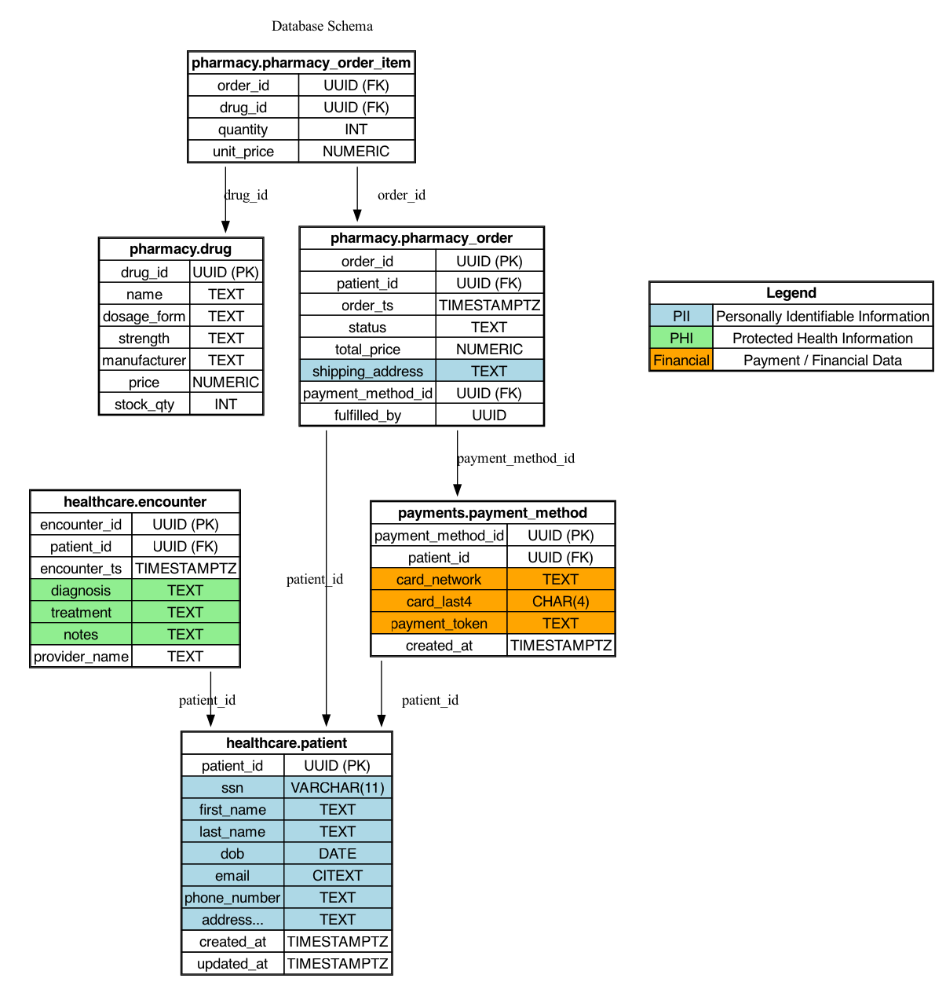

# LoadR: Data & Workload Generator

LoadR is a synthetic data and workload generator for PostgreSQL and MySQL, designed to produce realistic queries that exercise PII, PHI, and financial data fields for testing AuditR's audit log processing capabilities.

## Database Schema

The database schema models a simplified healthcare, pharmacy, and payments system.  
It is designed to include realistic **relationships** and **sensitive data types** for workload simulation and auditing.

### Highlights
- **Healthcare**: Patients and their encounters (PHI + PII).  
- **Pharmacy**: Drugs, orders, and order items (joins to patients and payments).  
- **Payments**: Payment methods linked to patients (Financial data).  
- **Foreign keys** ensure consistency across schemas in both PostgreSQL and MySQL.  
- **Sensitive fields** are explicitly marked and color-coded in the diagram.

### Sensitivity Legend
- 🟦 **PII**: Personally Identifiable Information  
- 🟩 **PHI**: Protected Health Information  
- 🟧 **Financial**: Payment / Financial Data  

### ER Diagram


*(SVG version available in `schema.svg` for zoomable detail.)*

### Sensitive Column Reference

This section documents all sensitive columns in the database schema for reference:

**PII (Personally Identifiable Information):**
- `ssn` - Social Security Number
- `first_name` - Patient first name
- `last_name` - Patient last name
- `dob` - Date of birth
- `email` - Email address
- `phone_number` - Phone number
- `address_line1`, `address_line2`, `city`, `state`, `postal_code` - Address components
- `shipping_address` - Shipping address

**PHI (Protected Health Information):**
- `diagnosis` - Medical diagnosis
- `treatment` - Treatment information
- `notes` - Clinical notes

**Financial:**
- `card_network` - Payment card network (Visa, Mastercard, etc.)
- `card_last4` - Last 4 digits of card
- `payment_token` - Payment tokenization identifier

## Data Generation

### Data Generation Phase (loadr load)

LoadR generates ready-to-import SQL seed files containing:

#### Schema (DDL)
- **Postgres**: creates healthcare, pharmacy, and payments schemas.
- **MySQL** : creates one DB (practicumdb) with prefixed table names.

#### Indexes
- On common PII/PHI/Financial fields for efficient lookups.

#### Synthetic Data
- Patients, encounters, drugs, orders, payments.
- Uses [gofakeit](https://github.com/brianvoe/gofakeit) and curated lists (see common_data.go).
- Consistent FKs across tables (patient_ids, order_ids, drug_ids).

#### Database Users
- Creates multiple users (appuser1..N) with password.
- Grants them SELECT/INSERT/UPDATE/DELETE on all tables.
 
### Example Config (`config_pg.yaml`)

```yaml
driver: postgres            # Target driver: postgres or mysql
database: practicumdb       # Database name
output: seed_pg.sql         # Output SQL file
seed: 42                    # RNG seed for reproducibility

patients: 1000              # Number of patients
encounters: 2000            # Number of encounters
drugs: 200                  # Number of drugs
orders: 1500                # Number of pharmacy orders
dbUsers: 5                  # Number of database users (appuser1..5)
```

### Example Config (`config_mysql.yaml`)
```yaml
driver: mysql
database: practicumdb
output: seed_mysql.sql
seed: 42

patients: 1000
encounters: 2000
drugs: 200
orders: 1500
dbUsers: 5
```

### Usage
```bash
make

# Build binaries
make

# Generate Postgres seed SQL
./bin/loadr load --config config_pg.yaml

# Generate MySQL seed SQL
./bin/loadr load --config config_mysql.yaml

```
This produces `seed_pg.sql` or `seed_mysql.sql` containing:

- `DROP/CREATE SCHEMA` (Postgres) or `DROP/CREATE DATABASE` (MySQL).
- `CREATE TABLE` statements with comments annotating PII, PHI, Financial fields.
- `INSERT` statements with synthetic values.
- `CREATE INDEX` statements on key fields.
- `CREATE USER` and `GRANT` statements for multi-user audit simulation.

### Import into DB:
``` bash
# Postgres
createdb -U vaibhaw practicumdb
psql -U <admin_user> -d practicumdb -f seed_pg.sql

# MySQL
mysql -u <admin_user> -p <pwd> < seed_mysql.sql
```

### 🔍 Verification

After seeding, you can verify your data and users with:

```bash
# Postgres
psql -U <user> -d practicumdb -f verify_pg.sql

# MySQL
mysql -u <user> -p practicumdb < verify_mysql.sql
```
The verify scripts are available under `/scripts`.

## Workload Generation

### Workload Phase (`loadr run`)

After seeding, **LoadR** can simulate realistic database workloads that generate audit logs. Queries are executed directly against the DB under multiple app users.

#### Features
- **Operation mix**: configurable ratio of `SELECT` (reads) vs `UPDATE` (writes).  
- **Sensitivity mix**: configurable ratio of queries targeting sensitive-only (PII/Financial), mixed (PII + PHI + Financial), and non-sensitive data.  
- **User simulation**: queries are executed under different users (`appuser1..N`) to simulate multiple actors.  
- **Annotations**: every query includes identifying comments (run ID, op type, sensitivity, user, timestamp) to aid log analysis.  
- **Concurrency**: configurable workers and total operations; RNG seed ensures reproducibility.

#### Example Config (`run_pg.yaml`)
```yaml
driver: postgres
database: practicumdb

users:
  - username: appuser1
    password: <>
  - username: appuser2
    password: <>
  - username: appuser3
    password: <>
  - username: appuser4
    password: <>
  - username: appuser5
    password: <>

seed: 42
runId: pg_demo001

concurrency: 5
totalOps: 200

mix:                      # Operation mix
  select: 0.7
  update: 0.3

sensitivity:              # Sensitivity mix
  sensitive_only: 0.4
  mixed: 0.4
  non_sensitive_only: 0.2

host: 127.0.0.1
port: 5432
```

### Usage
```bash
# Run Postgres workload
./bin/loadr run --config run_pg.yaml

# Run MySQL workload
./bin/loadr run --config run_mysql.yaml
```

This will
- Connect as multiple users (`appuserN`).
- Execute queries per the configured workload.
- Insert identifying comments in each query for downstream parsing by AuditR.
- Generate realistic audit log entries in pgAudit (Postgres) or Percona Audit Plugin (MySQL).

#### Sample Annotated Query
Workload queries are annotated to make audit logs self-describing:
```sql
/* run_id=pg_demo001 op=select sensitivity=mixed user=appuser3 ts=2025-09-13T10:00:00Z */
SELECT p.email, e.diagnosis, o.total_price, pm.card_last4
FROM healthcare.patient p
JOIN healthcare.encounter e ON p.patient_id = e.patient_id
JOIN pharmacy.pharmacy_order o ON p.patient_id = o.patient_id
JOIN payments.payment_method pm ON p.patient_id = pm.patient_id
WHERE p.patient_id = 'f1a2b3c4-5678-90ab-cdef-1234567890ab'
LIMIT 5;
```

#### 🔍 Verification after run
Once the workload completes:
1. **Check audit logs** :
    -  Postgres: queries should appear in pgAudit logs, including the identifying comments.
    - MySQL: queries should appear in the Percona Audit Log Plugin output.
2. **Confirm multi-user activity**:
    - Ensure queries in logs show different appuserN roles.
3. **Verify updates**:
    - Run queries in the DB to confirm changes, e.g.:
    ```sql
    SELECT phone_number FROM healthcare.patient LIMIT 5;
    SELECT stock_qty FROM pharmacy.drug LIMIT 5;
    ```
4. **Look for annotations**:
    - Every logged query should include the `/* run_id=... */` comment block for traceability.
    - Likely file path on MacOS Homebrew:
        - **Postgres** : `/opt/homebrew/var/log/postgresql@16.log` 
        - **MySQL** : `/opt/homebrew/var/mysql/audit.log`
